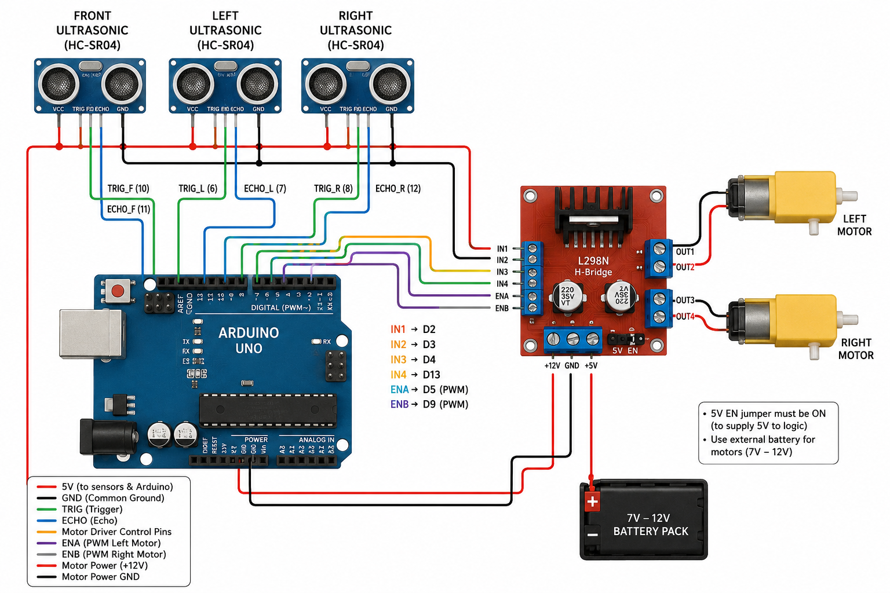

# 🤖 Robotron — PD Controlled Maze Solving Bot

An autonomous maze-solving robot built on Arduino Uno that uses a PD (Proportional-Derivative) controller to navigate through a maze by following walls and avoiding obstacles using 3 ultrasonic sensors.

---

## 📸 Circuit Diagram

---

## ⚙️ How It Works

The robot reads distances from 3 HC-SR04 ultrasonic sensors (Front, Left, Right) and makes decisions every 30ms:

- **Normal movement** → PD controller keeps the robot centered between left and right walls
- **Front blocked** → turns toward the side with more open space
- **Dead end** → all 3 sides blocked, robot stops completely

---

## 🧠 PD Controller

| Parameter | Value | Effect |
|-----------|-------|--------|
| `baseSpeed` | 120 | Base forward speed of both motors |
| `Kp` | 2.5 | Corrects based on how far off-center the robot is |
| `Kd` | 3.5 | Dampens oscillation, smoothens correction |

The error is calculated as `dL - dR` (left distance minus right distance).
A zero error means the robot is perfectly centered.

---

## 🛠️ Components

| Component | Quantity |
|-----------|----------|
| Arduino Uno | 1 |
| HC-SR04 Ultrasonic Sensor | 3 |
| L298N Motor Driver | 1 |
| DC Motors | 2 |
| 9V / 12V Battery | 1 |
| Jumper Wires | as needed |
| Chassis | 1 |

---

## 🔌 Pin Mapping

| Component | Pin |
|-----------|-----|
| Front Sensor TRIG | 10 |
| Front Sensor ECHO | 11 |
| Left Sensor TRIG | 6 |
| Left Sensor ECHO | 7 |
| Right Sensor TRIG | 8 |
| Right Sensor ECHO | 12 |
| IN1 (Left Motor) | 2 |
| IN2 (Left Motor) | 3 |
| IN3 (Right Motor) | 4 |
| IN4 (Right Motor) | 13 |
| ENA (Left PWM) | 5 |
| ENB (Right PWM) | 9 |

---

## 📁 Repository Structure
PID_CONTROLLED_BOT_Robu/
│
├── robu_final.ino       # Arduino source code
├── ckt_diagram.png      # Circuit diagram
└── README.md            # Project documentation

---

## 🚀 How to Upload

1. Open `robu_final.ino` in **Arduino IDE**
2. Connect Arduino Uno via USB
3. Select **Board** → Arduino Uno
4. Select correct **Port**
5. Click **Upload**

---
## 🎛️ Tuning Guide — Customize for Any Surface

Depending on your surface, maze size, and motor strength you can tweak these parameters directly in the code:

| Parameter | Location in Code | Default | What to Change |
|-----------|-----------------|---------|----------------|
| `baseSpeed` | line 10 | `120` | Increase on smooth surfaces, decrease on rough/carpet |
| `Kp` | line 12 | `2.5` | Increase for tighter correction, decrease if robot wobbles |
| `Kd` | line 13 | `3.5` | Increase to reduce oscillation, decrease if robot reacts too slowly |
| Front stop distance | line 47 `dF < 12` | `12 cm` | Increase for faster turns, decrease for closer wall detection |
| Dead end distance | line 40 `< 10` | `10 cm` | Adjust based on maze corridor width |
| Turn duration | line 52 `delay(150)` | `150 ms` | Increase for wider turns, decrease for tighter maze corners |
| Correction limit | line 60 `constrain(-40, 40)` | `±40` | Increase for sharper steering, decrease for smoother driving |

---

## 🧠 Decision Table — Diagnosing Problems in Real Time

Use these tables to identify and fix issues while testing your robot.

### 🔵 Straight Corridor

| Symptom | What it means | Fix |
|---------|--------------|-----|
| Zig-zagging | `Kp` too high | Lower `Kp` (try `2.0`) |
| Fast vibration | `Kd` too low | Increase `Kd` (try `4.0`) |
| Slow correction | `Kp` too low | Increase `Kp` (try `3.0`) |
| Sudden jerks | `Kd` too high | Lower `Kd` (try `2.5`) |
| Constant wall bias | Sensor or mechanical offset | Check sensor alignment or add offset calibration in code |

---

### 🔵 90° Turns

| Symptom | Fix |
|---------|-----|
| Hits wall while turning | Lower turn speed by 10 |
| Over-rotates | Lower `delay(150)` by 30–50ms |
| Under-rotates | Increase `delay(150)` by 30–50ms |
| Slips / skids | Lower turn speed |

---

### 🔵 Dead End

| Symptom | Fix |
|---------|-----|
| Scrapes walls | Lower rotate speed by 10 |
| Doesn't fully turn | Increase rotate delay by 50ms |
| Reverse wobbles | Lower reverse speed |
| Stuck during reverse | Increase reverse delay slightly |

---

### 💡 Quick Tips

- **Slow robot / low power motors** → lower `baseSpeed` to `80-100`
- **Wobbling side to side** → increase `Kd` slightly (try `4.0 - 5.0`)
- **Not correcting enough** → increase `Kp` slightly (try `3.0 - 3.5`)
- **Hits walls before turning** → increase front stop distance from `12` to `18-20`
- **Carpet or rough surface** → increase `baseSpeed` to `150-180`
- **Wide maze corridors** → increase dead end threshold from `10` to `15`

## 📌 Known Limitations

- Turning is open-loop (fixed 150ms delay, no sensor feedback during turn)
- Dead end detection is a terminal state, no recovery
- No memory of visited paths, purely reactive navigation

---

## 👤 Author
**Tanvi Biswas**
